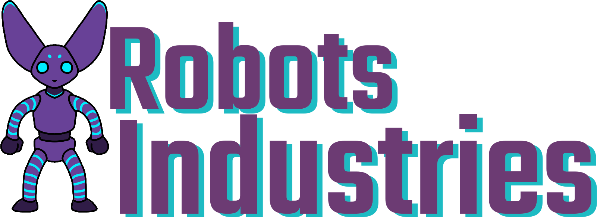

# Robots Industries



Automate robots building, make money.

## Summary

This program is a quick exercise about assembling foobar by an automated system.

## Installation

Its recommend to install the program via a virtual env. You have multiple way to do it. This project is based on a `pyproject.toml` with poetry as the builder tool. Here is command to use:

```
poetry shell # Enable the virtualenv
poetry install --no-dev # Install the project dependencies
```

## Usage

```
usage: robots_factory [-h] [--speed SPEED]

Robots Industries, automate robots building, make money.

options:
  -h, --help     show this help message and exit
  --speed SPEED  Speed multiplicator for a second. Default to 1.
```

## Development

All the dependencies are installable via `poetry install`

### Lint

This project use flakeheaven for executing lint rules

```
flakeheaven lint robots_industries
```

### Tests

For unit test this project use `pytest-cov`

```
pytest --cov=robots_industries tests
```

If needed you can also generate the html report

```
pytest --cov=robots_industries --cov-report term --cov-report html tests
cd htmlcov
python -m http.server
```

## Interpretations & technical choices

### Inventory system

For now most of the checks for which activity to choose from are based on the content of the inventory are pretty basic. I didn't want, yet, to have a too complicated implementation and prefer to keep thing simple. This could change if productivity and efficiency are something we would want to have.

### Item<T> classes

While there is only an Item class for Integer the idea was to hide most of the logic of multiprocessing.Value behind classes for make more readable Robot class. One of the problematic of my current implementation is that its needed to rewrite all the method of the non mutable classes.

### Unittest

Not all the code is cover by the tests but most of it is. This project has not been made in a TDD methodology mainly because it was one of the first time where I was using the multiprocessing module. This has for consequence to make the code more complicated that it should have been.

### Production of foobar

While the goal is about automatic production of `foobar`, the story has more be made around `robots` and so the output of the program but the end goal is the same, there is a production of `foobar`.

## Future

In the future it would have been nice to have an UI for visualizing the robots in actions. This will need more research on my part since I'm not yet sure what to use.
